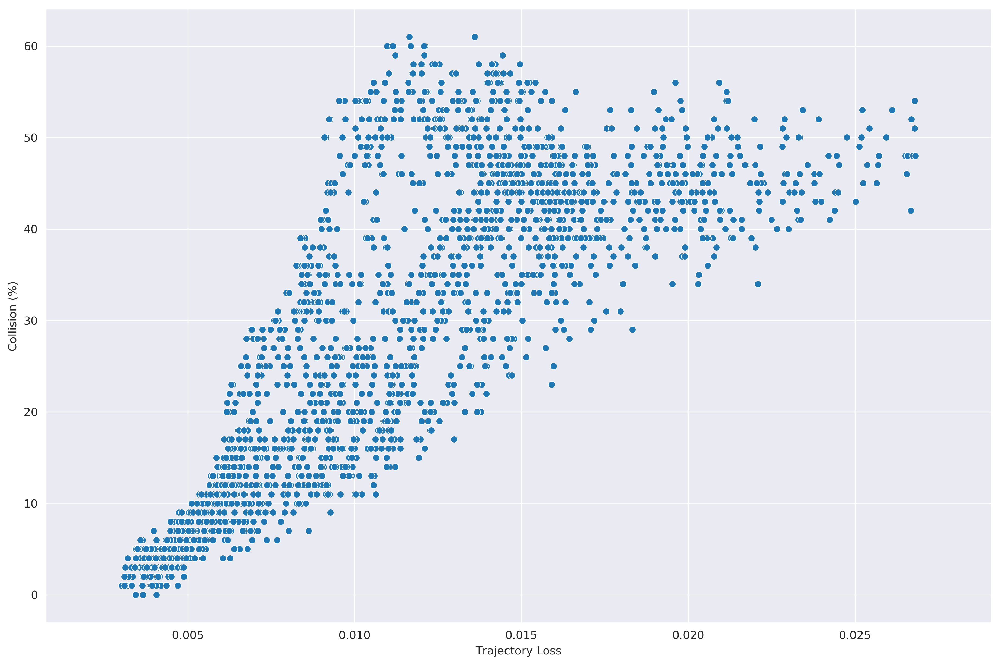

## Performance


### Training & Evaluation

* Behavioral Cloning (Vanilla)
 ```
 python imitate.py --gpu
 python utils/tests.py --model_path data/output/imitate-baseline-data-0.5-traj
 ```
* Social-NCE ([Social-NCE paper](https://arxiv.org/abs/2012.11717)).
 ```
 python imitate.py --auxiliary_task contrastive --contrast_weight 2.0 --contrast_sampling event --gpu
 python utils/tests.py --model_path data/output/imitate-event-data-0.5-weight-2.0-horizon-4-temperature-0.20-nboundary-0-traj
 ```
* TrajPred (proposed) 
 ```
 python imitate.py --auxiliary_task traj --traj_weight 2.5 --traj_length 4 --gpu
 python utils/tests.py --model_path data/output/imitate-trajpred-2.50-weight-1to4-length-traj
 ```
* Comparison
 ```
 python utils/compare.py
 ```
### Results

  
 

## Danger Evaluation

The policies learned via imitation or reinforcement learning, even though highly performant in the environment they are trained in, suffer from the distributional shift
in human behaviour during test time. Interacting with these new enviormnents might result in a high collision rate. The natural task for such scenarios would be to 
have a mechanism to infer the robot-pedestrian collision probability of a new enviorments with the human motions as input. 

The proposed imitator (TrajPred) human trajectory forecasting accuracy does not require interacting with the environment and can therefore be used to that end.

### Evaluation 
The imitator trained in the performance section is used to evaluate the method 

In case you did not run the training in the first section of the readme, you can directly download the trained imitatior :
 ```
 TODO
 ```
 
 To test the method, we evaluate the correlation between trajectory forecasting accuracy and collision rate.
 We sample multiple new environments and, for each :
 1. Have the robot observe human motions and test its trajectory forecasting accuracy
 2. Deploy the robot in this new simulated environment and observe the pedestrian-robot collision probability 
 
Testing :
 ```
 python multi_env/correlation.py --figs 
 ```
 
 The testing is heavily time consuming (up to 12hrs), you can directly download the results via this command if desired :
 ```
 TODO
 ```
 
 
 
### Acknowledgments

This code is developed based on [CrowdNav](https://github.com/vita-epfl/CrowdNav) and [Social-NCE](https://github.com/vita-epfl/social-nce)

