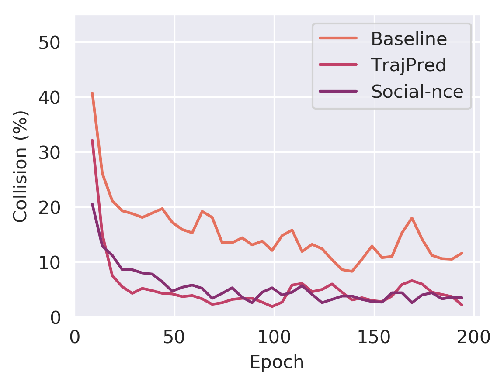
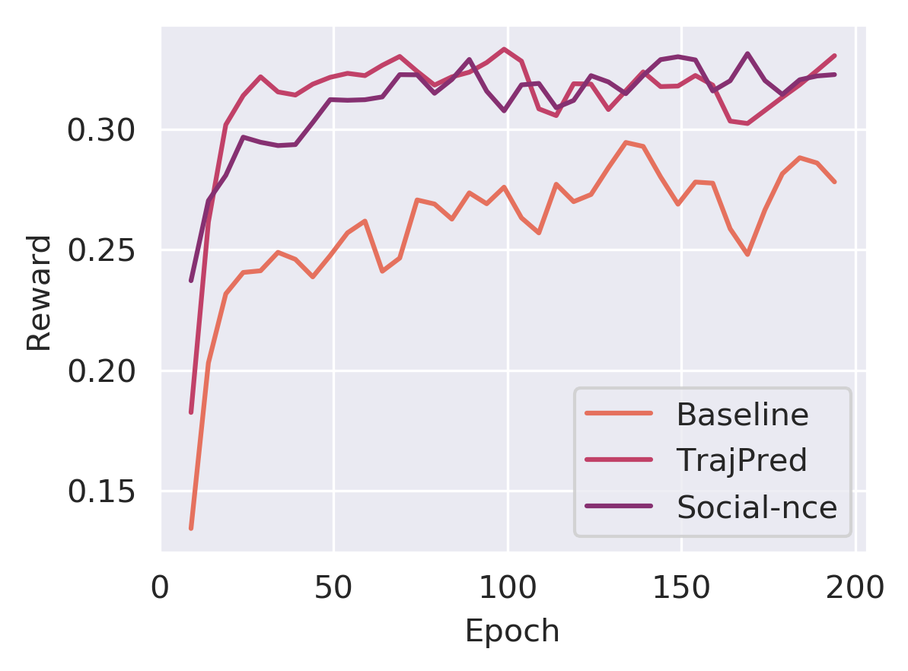
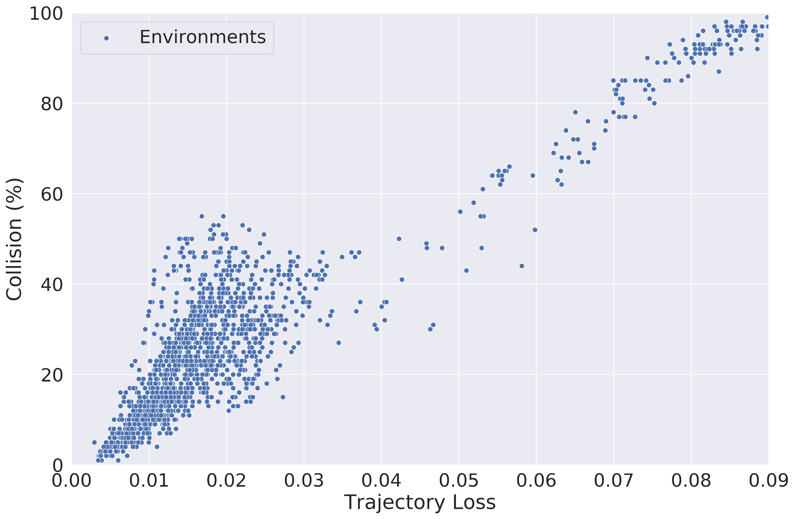
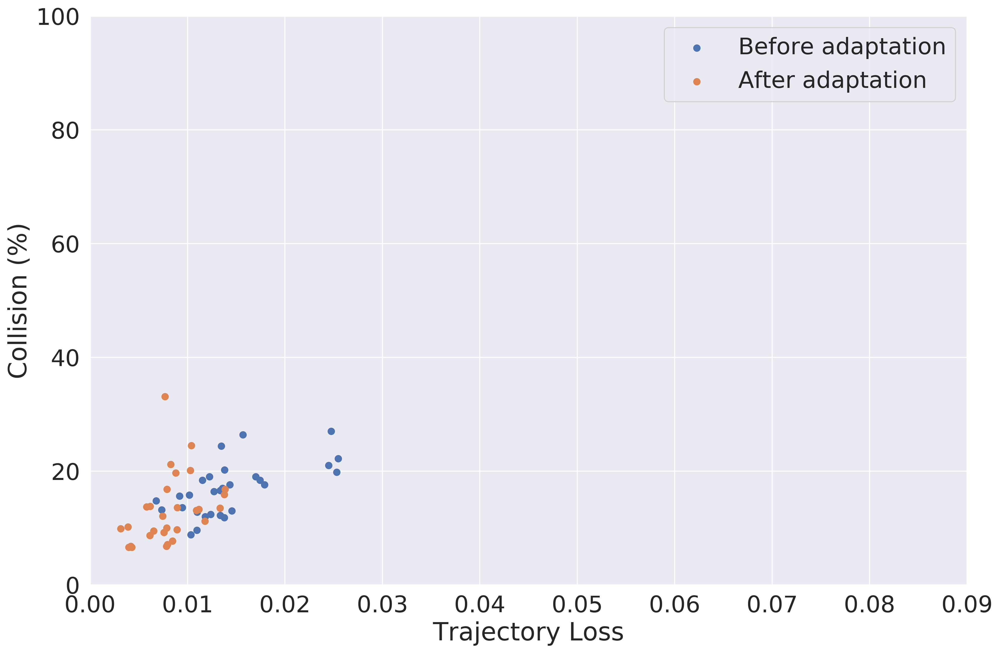
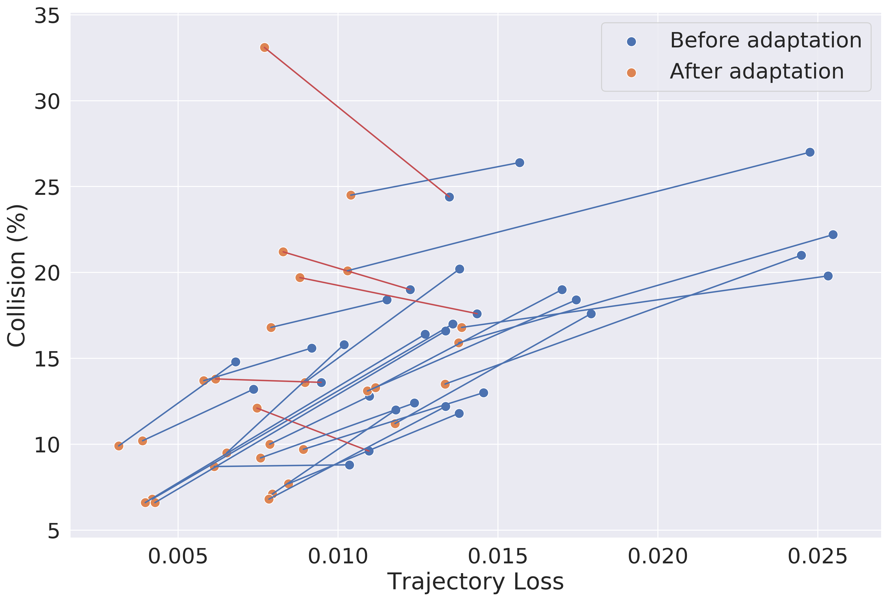

# Cross Domain Robot Navigation with Policy Learning 

## Preparation

Setup environments follwoing the [SETUP.md](docs/SETUP.md)

## Performance

### Training & Evaluation

* Behavioral Cloning (Vanilla)
 ```
 python imitate.py --gpu
 python utils/tests.py --model_path data/output/imitate-baseline-data-0.5-traj
 ```
* Social-NCE ([Social-NCE paper](https://arxiv.org/abs/2012.11717)).
 ```
 python imitate.py --auxiliary_task contrastive --contrast_weight 2.0 --contrast_sampling event --gpu
 python utils/tests.py --model_path data/output/imitate-event-data-0.5-weight-2.0-horizon-4-temperature-0.20-nboundary-0-traj
 ```
* TrajPred (proposed) 
 ```
 python imitate.py --auxiliary_task traj --traj_weight 2.5 --traj_length 4 --gpu
 python utils/tests.py --model_path data/output/imitate-trajpred-2.50-weight-1to4-length-traj
 ```
* Comparison
 ```
 python utils/compare.py
 ```
### Results

  
 

## Danger Evaluation

The policies learned via imitation or reinforcement learning, even though highly performant in the environment they are trained in, suffer from the distributional shift in human behavior during test time. Interacting with these new environments might result in a high collision rate. The natural task for such scenarios would be to 
have a mechanism to infer the robot-pedestrian collision probability of a new environments with the human motions as input. 

The proposed imitator (TrajPred) human trajectory forecasting model does not require interacting with the environment and can therefore be used to that end.

### Evaluation 
The imitator trained in the performance section is used to evaluate the method 

In case you did not run the training in the first section of the README, you can directly download the trained imitator :
 ```
 TODO
 ```
 
 To test the method, we evaluate the correlation between trajectory forecasting accuracy and collision rate.
 We sample multiple new environments and, for each :
 1. Have the robot observe human motions and test its trajectory forecasting accuracy
 2. Deploy the robot in this new simulated environment and observe the pedestrian-robot collision rate 
 
Testing :
 ```
 python multi_env/correlation.py --figs 
 ```
 
 ### Results
 

## Policy improvement w/o robot-pedestrian interaction

In order for the robot to improve in an unknown environment (different than the one it is trained in), it would require further robot-pedestrian interaction. As we have seen, depending on the type of human motions, this process can be highly dangerous and lead to many collisions. Using our method, the sample complexity is much lower than the baseline which ultimately leads to fewer robot-pedestrian interactions needed for policy improvement.    

Furthermore the drop in performance of the robot in new environments is highly correlated to its human trajectory forecasting accuracy. This part of the model can be improved without any interaction with the environment and should also increase the overall performance of the robot. This can be used to improve the robot performance in new environments without the need of dangerous robot-pedestrian interactions.


### Evaluation  

The imitator trained in the performance section is used to evaluate the method 

In case you did not run the training in the first section of the README, you can directly download the trained imitator :
 ```
 TODO
 ```

In order to evaluate the method we sample new environments and, for each :
 1. Evaluate the initial robot performance in this new environment (collision rate)
 2. Have the robot improve its trajectory forecasting model by observing the human motions
 3. Evaluate again the robot performance and compare with the initial

Gather data and initial performances :
```
 python multi_env/improvement_data.py 
 ```

Improve the robot :
```
 python multi_env/improvement.py 
 ```

Evaluate :
```
 python multi_env/improvement_tests.py 
 ```

 ### Results

 
 
### Acknowledgments

This code is developed based on [CrowdNav](https://github.com/vita-epfl/CrowdNav) and [Social-NCE](https://github.com

